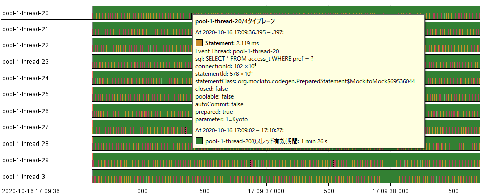
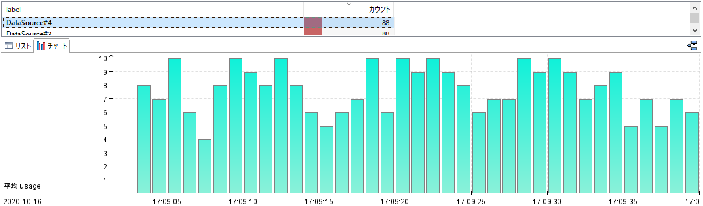

# 概要
Jfr4Jdbc はデータベースサーバの種類を問わず利用できる JDBC のラッパーライブラリです。
Jfr4Jdbc を使うとユーザはシステムの性能問題が Java アプリケーションとデータベースのどちらで起きているか簡単に分かるようになります。

Jfr4Jdbc は JDBC に対する操作をイベントとして JDK Flight Recorder (JFR) に記録します。
この記録にかかる負荷はわずかです。
ユーザは JFR をダンプし、そのダンプファイルを JDK Mission Control で開くと GUI でデータベース操作を確認できます。
これによってユーザは全てのデータベース処理の問題点をグラフィカルに解析できるようになります。

ユーザは JFR が有効になっているJVMで、これをライブラリとして追加し、JDBCの接続文字列に`jfr:`を追加するだけで、使用できます。
このドライバを使用すると、接続、ステートメント、コミットなどのデータベースアクセスの情報をJFRのイベントとして取得できます。

また、APIによるきめ細かな制御もサポートされています。例えば、一部のデータベース接続のみを分析したい場合、分析したいJDBCオブジェクト（DataSourceやConnectionなど）をJfr4jdbcDataSourceなどのJfr4Jdbcが提供するJDBCオブジェクトでラップして使用します。

# なにが見られるか

Jfr4Jdbc を使用するとスレッドが処理しているうち、どの時間にデータベースに対する処理をしているかが分かるようになります。
この機能によって接続、ステートメントの実行、コミットなどデータベースに対する操作のうちどの処理に時間が掛かっているかを視覚的に判断できます。


Jfr4Jdbc を使用すると、コネクションがどれだけ使用されていて、どれくらいの数のスレッドがコネクションの割り当て待ちで処理が止まっているかを解析できます。
これはデータソースに管理されているコネクションはデータソースごとにグループ化されます。
これによって、どのコネクションプールが不足しているか、どのデータベースへの接続に時間が掛かっているかを特定できます。


# 記録されるイベント

APIを使用してデータベースにアクセスするたびに、以下の情報を取得できます。
- データソースから接続を取得する
- データベースへの接続を確立する
- 接続を閉じる
- ステートメントの実行
- 結果セットの取得
- コミット
- ロールバック
- キャンセル

さらに、デフォルトで1秒ごとに以下の数値を取得できます。
- 使用中の接続数
- 割り当て待ちの接続

# サポートされる環境
- JDBC 4.2 と OpenJDK 8 update 272
- JDBC 4.3 と OpenJDK 11以降

Oracle JDKのような公開されていないJDKはサポートしていません。

# ダウンロード方法
[Maven Central](https://search.maven.org/artifact/dev.jfr4jdbc/jfr4jdbc-driver) からJARファイルをダウンロードできます。

Maven や Gradle などのビルド自動化ツールで依存関係を管理している方は、依存関係に以下を追加してください。
### Maven
```xml
<dependency>
  <groupId>dev.jfr4jdbc</groupId>
  <artifactId>jfr4jdbc-driver</artifactId>
  <version>1.3.0</version>
</dependency>
```

### Gradle
```xml
implementation 'dev.jfr4jdbc:jfr4jdbc-driver:1.3.0'
```

### Scala SBT
```xml
libraryDependencies += "dev.jfr4jdbc" % "jfr4jdbc-driver" % "1.3.0"
```

### Bazel
```
maven_jar(
    name = "jfr4jdbc-driver",
    artifact = "dev.jfr4jdbc:jfr4jdbc-driver:1.3.0",
    sha1 = "669dd4fa8797e04a79ab5e13e29d646e2863d76d",
)
```

# 使い方
Jfr4jdbc は後述のAPIを使用して統合できますが、最も簡単な方法は、JDBCの接続文字列に `jfr:` を追加することです。

アプリケーションフレームワークとして Quarkus や Spring Boot を使用している場合は、以下のように`jfr:`を追加します。

### Quarkus
```properties
quarkus.datasource.jdbc.url=jdbc:jfr:postgresql://localhost:5432/xxx
```

### Spring Boot
```properties
spring.datasource.url=jdbc:jfr:postgresql://postgres:5432/xxx
```

# コード上での使い方
このAPIでは、キャプチャするイベントをより細かく制御できます。

## javax.sql.DataSourceと使う
Jfr4jdbcDataSourceのコンストラクタ引数にjavax.sql.DataSourceのインスタンスを渡すことで、このデータソースが管理するすべての接続とそれが生成したすべてのステートメントのイベントを記録できます。

```java
OracleDataSource ds = new OracleDataSource();  
ds.setURL("jdbc:oracle:thin:user/passwd@localhost:1521:XE");  
Jfr4jdbcDataSource jds = new Jfr4jdbcDataSource(ds);  
Connection con = jds.getConnection();
```

## java.sql.Driverと使う
JDBC接続文字列の `jdbc:` の後ろに `jfr:` を追加してください。
この接続で生成されたすべてのステートメントに対してイベントを記録できます。

```java
String url = "jdbc:jfr:oracle:thin:user/passwd@localhost:1521:XE";  
Driver driver = DriverManager.getDriver(url);  
Connection con = driver.connect(url, null);  
```

## 使用方法

- [Quarkusとの統合](doc/Quarkus_jp.md)
- [特定の処理だけで使う方法](doc/Wrap_jp.md)
